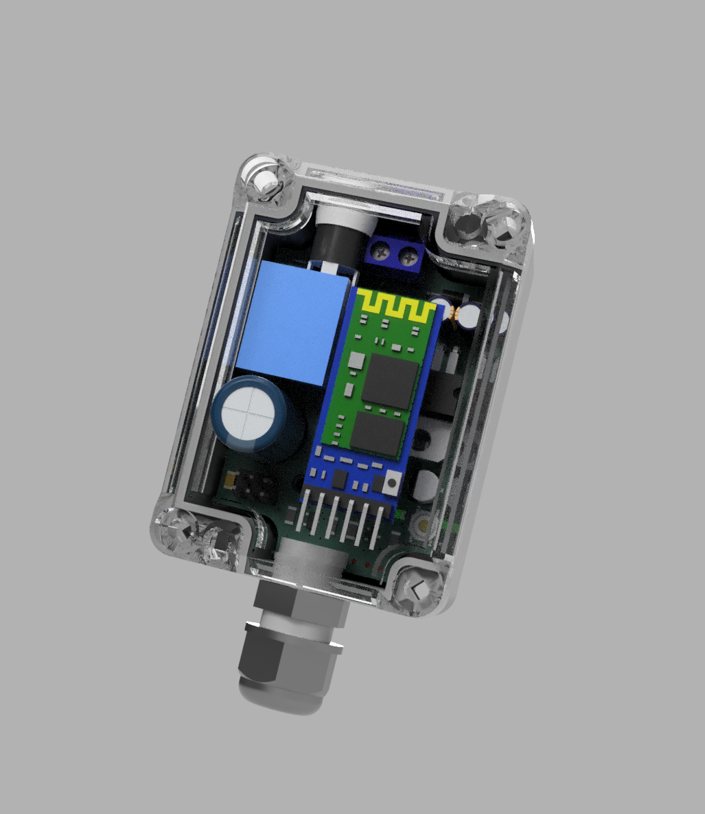
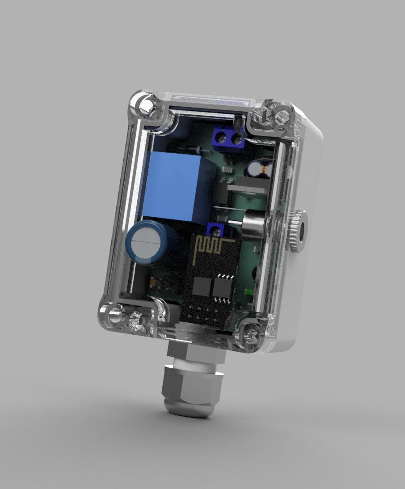

# atmega328-driven-ws2811-led-strip-driver-with-at-09-bluetooth

This project contains a WS2811 LED strip driver hardware with 2 different communication modes with appropirate Arduino sketches for each. 

The two communication modes are the following:

* **WiFi** supported by an ESP8266 Wifi module
* **BLE** supported by an AT-09 Bluetooth module

## Bluetooth version

I've used the following AT commands in order to change the behaviour (changing name, changing pin and the baud rate) of the BLE module and I've done them before attaching it to the board. 

* AT+NAME
* AT+PIN
* AT+BAUD

After this procedure the module is ready to be assembled.

**Useable commands and their descriptions in the following format: "command" - description**
* "A" - Red color mode
* "B" - Green color mode
* "C" - Blue color mode
* "D" - Rainbow 1 mode
* "E" - Rainbow 2 mode
* "F" - Custom color mode
* "G,<color red 0..255>,<color green 0..255>,<color blue 0..255>" - Color setting command
* "H" - Relay on command
* "I" - Relay off command

## WiFi version

